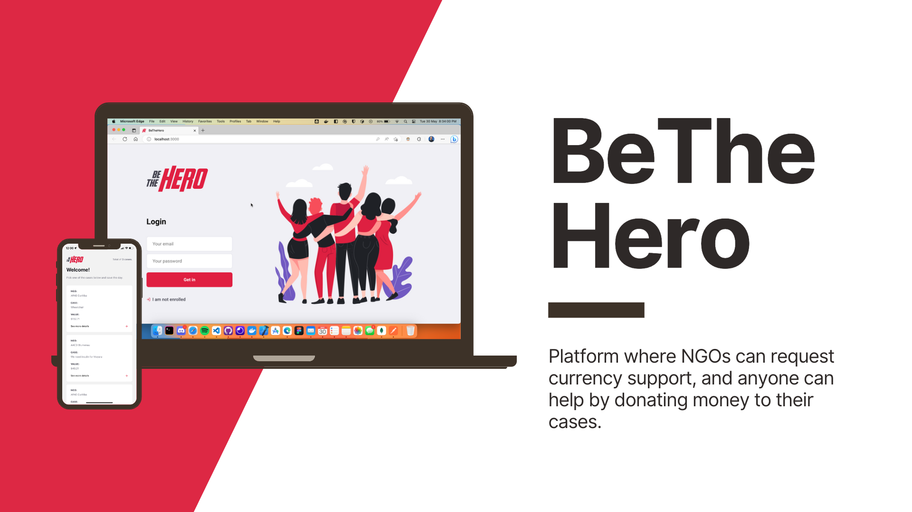
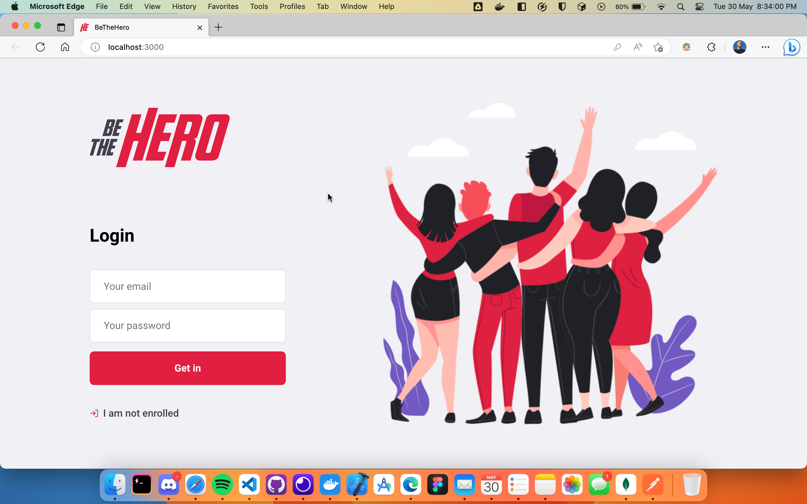
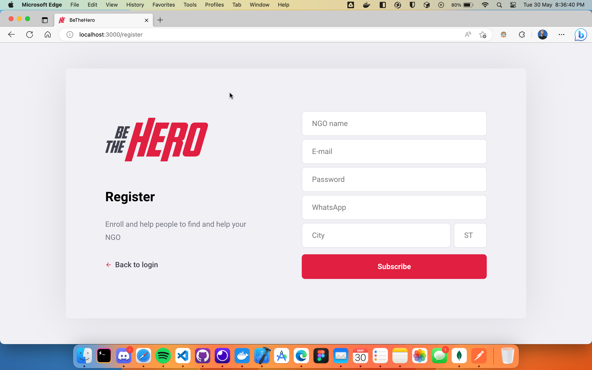
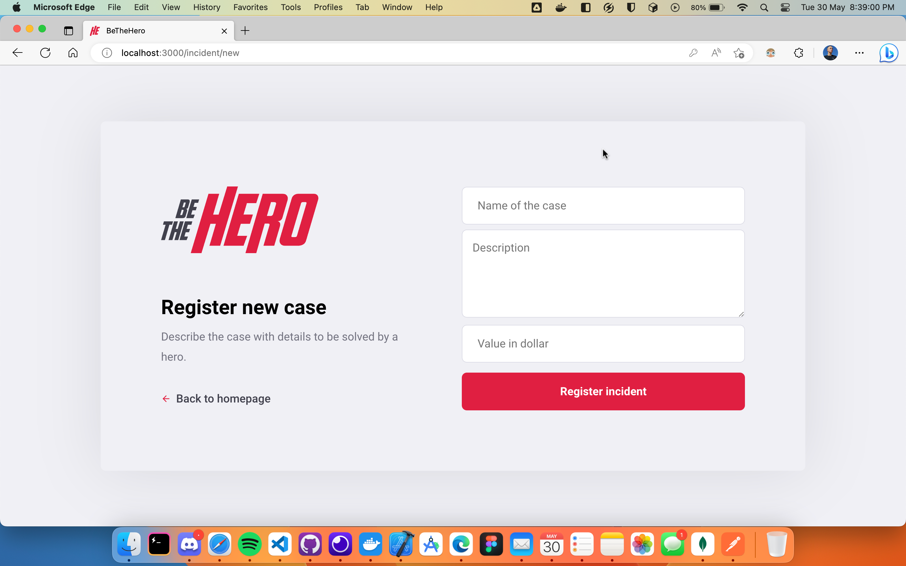
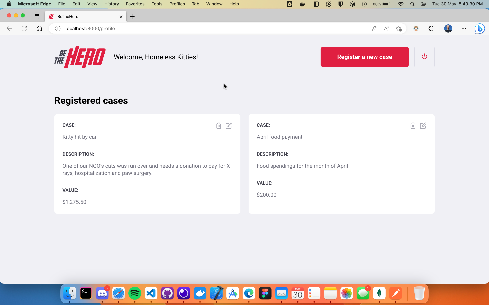

# Summary

- [Summary](#summary)
- [Introduction](#introduction)
- [How to run](#how-to-run)
- [Server](#server)
- [Web](#web)
- [Mobile](#mobile)
- [Interface](#interface)
- [Web interface](#web-interface)
- [Mobile interface](#mobile-interface)
- [Author](#author)

# Introduction

**BeTheHero** is a platform where NGOs can request currency support, and anyone can help by donating money to their cases.

> I started this full-stack project during **Semana Omnistack 11** in 2020 to get started on my studies on ExpressJs, React, and React Native and kept it updated until May 30, 2023.

BeTheHero was set up with the following technologies:

- **server api:** ExpressJS
- **database:** MongoDB
- **web interface:** ReactJS
- **mobile:** React Native through Expo
- **validations:** Express Validator
- **tests:** Supertest

# How to run

- ⚠️ You **must** run the server module in the background so you can use both the web and the app.

- **Optional:** See the [Postman project](https://www.postman.com/arthurdiluz-team/workspace/bethehero).

## Server

**Note: make sure your NodeJS is updated.**

First, install the dependencies in _package.json_.

`> npm install`

Now you need to create an account in [MongoDB Atlas](https://cloud.mongodb.com/), create a project named 'BeTheHero', a database named 'bethehero', and then connect to MongoDB through the URI in _./server/src/database/index.js_.

Now create a file named _.env_ based on _.env.example_ and insert your values.

Now you're able to run the server.

**DEVELOPMENT:** _`> npm run dev`_

Now your server application must be running at the selected address.
You can now execute web and mobile applications.

## Web

First, install the dependencies in _package.json_.

`> npm install`

Now you're you can run the web application.

`> npm start`

Now the development server will run, and the addresses of your application will appear on Terminal.
The website will also open automatically in your main browser.

## Mobile

First, install the dependencies in _package.json_.

`> npm install`

- ⚠️ **IMPORTANT:** you'll have to edit **api.js** file and insert your computer's ID in the **baseURL** attribute _(line 8)_.

Now you can run the app.

`> npm start`

Now the Expo DevTools will open in your browser as well as the Metro Bundler.
There, you'll be able to choose where you'll run your application.
You can choose between:

- Android device or emulator
- iOS device or emulator _(emulator available only for macOS)_
- Web browser (emulated)

**if any errors occurrs, try to run the following command:**

> `> npm audit fix`

that the packages will be fixed.

# Interface

## Web interface

### **Login screen**

### **Register NGO**

### **Register Incident**

### **Homepage**

---

## Mobile interface

### **Home screen**

### **Case screen**

### **Texting through WhatsApp**

### **Texting through E-mail**

---

# Author

Made by [Arthur Diniz da Luz](https://arthurdiluz.github.io/).
